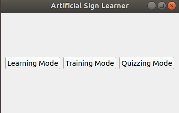
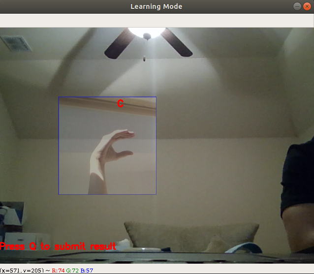
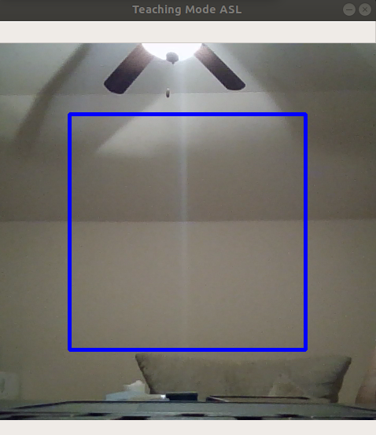
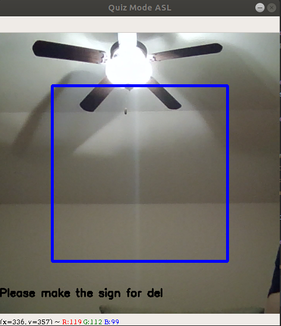

## Artificial Sign Learner
The American Sign Language is one of the most commonly used sign languages. As The Paralympic Games come near, the need for learning sign languages is expected to rise. However, a good sign language teacher is difficult to find and the lessons can be costly. Motivated by this need, our team designed an AI-based sign language learning program. With this program and its 3 different modes, anyone will be able to learn how to the ASL alphabet and test themself for free and at their own pace.

### Usage

#### Download this Github Repository
Run `git clone https://github.com/moose-not-found/ASL`

#### Install dependencies
Run the command `pip install -r requirements.txt`

#### Start the program
Run the command `python main.py`

### Different modes of the program

#### Learning Mode
In this mode, the user will be able to input the letter of the alphabet that they would like to query and learn, the program will enable the user's camera and begin a live-feed window. There will be a reference picture in the frame demonstrating the gesture for the letter and the user can imitate the picture to learn the sign for that letter. After the learning is done, the user can press <b>Q</b> on the keyboard while signing to the camera. The program will then stop the live feed and evaluate the user's gesture for accuracy.

#### Training Mode
In this mode, the user can practice signing any of the different letters learned from Learning Mode into the camera's live feed. After a short while, the program will evaluate nad report the top 3 most likely letters that the user signed with their respective probabilities. This is a practice mode for the user to test their newly developed skills.

#### Quizzing Mode
In this mode, the user will be quizzed. The program will randomly request a letter for the user to sign. Once the user signs it correctly, the program will provide another alphabet to sign. The goal is to sign as many letter correctly in about 20 seconds. This is a fun and interactive way to asses the user's progress.

#### Future Work
We wanted to add the feature heat map identifying properties of GradCam. With this added information, we could overlay it on top of the live video feed so that the user can get some feedback from the program and adjust their hand position. Due to lacking technology specifications, we were unable to implement this feature, and have had productive conversations with peers in the field for possible solutions.

### Reference
Credit of our CNN model goes to <a href="https://github.com/jonathanoheix/Real-Time-Face-Expression-Recognition">Jonathan Oheix</a>

Our database is from <a href=https://www.kaggle.com/grassknoted/asl-alphabet>here</a>

Grad-Cam inspiration from <a href=https://github.com/ramprs/grad-cam>Ramprasaath R. Selvaraju</a>
